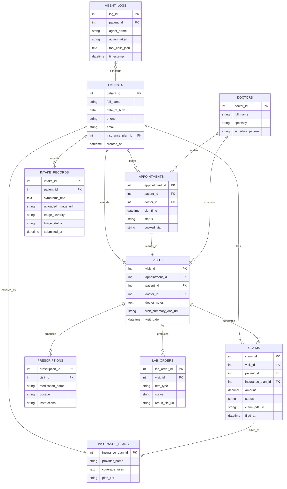
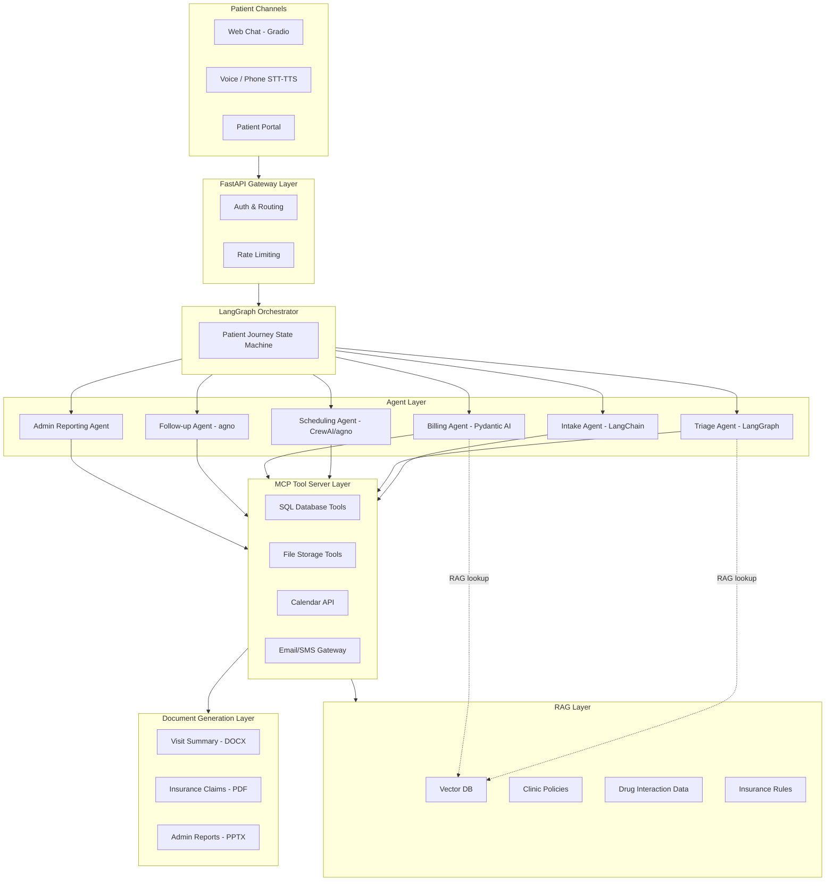
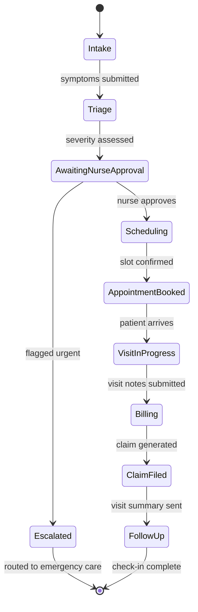
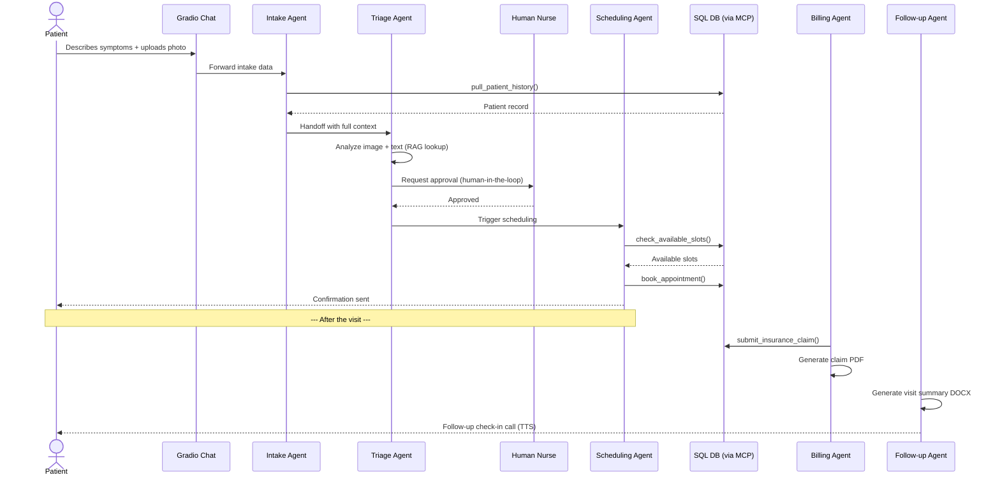

# MediCore AI — Project Documentation

**An AI-powered operations platform for small clinics, dental practices, and diagnostic centers**

---

## 1. Product Vision

Small and mid-sized healthcare practices lose hours a day to manual work: phone-based scheduling, repetitive intake forms, chasing insurance paperwork, and writing visit summaries. They can't afford enterprise EHR integrations, but they urgently need automation.

**MediCore AI** is a white-label, deployable AI assistant layer that clinics plug into their existing systems (patient DB, calendar, email) to automate:

- Patient intake and triage (chat + voice)
- Appointment scheduling and reminders
- Insurance/claims document drafting
- Lab report and prescription interpretation (OCR + summarization)
- Doctor-facing visit summary generation
- Practice-wide analytics reporting for admins

This is designed as a **real, sellable SaaS product** — not just a demo — with a clear target customer (independent clinics, dental offices, diagnostic labs, physiotherapy centers), a subscription pricing model, and a defensible feature set.

---

## 2. Why This Project Covers Everything You've Learned

| Skill / Technology | Where It's Used in MediCore AI |
|---|---|
| **OpenAI & Anthropic APIs** | Core LLM calls across every agent (GPT-4.1-mini for cost-sensitive tasks, Claude for clinical summarization requiring nuance) |
| **RAG (vector DB + embeddings)** | Clinic policy & FAQ knowledge base, drug-interaction lookup, insurance-plan rules retrieval |
| **Multi-agent systems (CrewAI / agno)** | Intake Agent, Triage Agent, Scheduling Agent, Billing Agent, Follow-up Agent — each with a distinct role and tools |
| **LangGraph (stateful workflows)** | The full patient journey graph: Intake → Triage → Scheduling → Visit → Billing → Follow-up, with human-in-the-loop checkpoints for doctor approval before anything patient-facing goes out |
| **Tool calling / function calling** | `check_available_slots()`, `pull_patient_history()`, `order_lab_test()`, `submit_insurance_claim()`, `send_reminder()` |
| **SQL database integration** | Patient records, appointment slots, billing status — backing every tool call |
| **MCP (Model Context Protocol)** | An MCP server exposing the clinic's SQL database and file storage to any agent framework, so agents/tools are framework-agnostic |
| **Multi-modal (image + audio)** | OCR + interpretation of uploaded prescriptions/lab reports (vision), voice-based phone intake (speech-to-text), automated reminder calls (text-to-speech) |
| **Document generation (PDF/DOCX/PPTX)** | Auto-generated patient visit summaries (DOCX), insurance claim forms (PDF), monthly ops reports for clinic admins (PPTX) |
| **Multiple agent frameworks (LangChain, OpenAI Agents SDK, Pydantic AI, Google ADK, Strands)** | Different subagents deliberately built on different frameworks to demonstrate framework fluency — e.g., Triage Agent on LangGraph, Billing Agent on Pydantic AI, a voice agent on OpenAI Agents SDK |
| **FastAPI + Uvicorn** | Backend API serving the agent orchestration layer |
| **Gradio** | Patient-facing chat widget + internal admin dashboard |
| **uv + pyproject.toml** | Reproducible environment management for the whole stack |

---

## 3. System Architecture

```
                        ┌─────────────────────────────┐
                        │        Patient Channels      │
                        │  Web Chat (Gradio) | Voice   │
                        │  Phone (STT/TTS) | Portal    │
                        └───────────────┬───────────────┘
                                        │
                        ┌───────────────▼───────────────┐
                        │      FastAPI Gateway Layer     │
                        │   (auth, routing, rate limits) │
                        └───────────────┬───────────────┘
                                        │
                        ┌───────────────▼───────────────┐
                        │     LangGraph Orchestrator     │
                        │  (stateful patient journey)    │
                        └───┬─────┬─────┬─────┬─────┬────┘
                            │     │     │     │     │
                    ┌───────▼─┐ ┌─▼───┐ ┌▼────┐ ┌▼────┐ ┌▼────────┐
                    │ Intake  │ │Triage│ │Sched-│ │Bill-│ │Follow-up│
                    │ Agent   │ │Agent │ │uling │ │ing  │ │ Agent   │
                    │(LangCh.)│ │(Lang-│ │Agent │ │Agent│ │(agno)   │
                    │         │ │Graph)│ │(CrewAI/│(Pyd.│ │         │
                    │         │ │      │ │agno) │ │AI)  │ │         │
                    └────┬────┘ └──┬───┘ └──┬───┘ └──┬──┘ └────┬────┘
                         │         │        │        │         │
                    ┌────▼─────────▼────────▼────────▼─────────▼────┐
                    │            MCP Tool Server Layer                │
                    │  SQL DB | File Storage | Calendar API | Email   │
                    └───────────────────────┬───────────────────────┘
                                            │
                    ┌───────────────────────▼───────────────────────┐
                    │        RAG Layer (Vector DB + Embeddings)      │
                    │   Clinic policies | Drug data | Insurance FAQ  │
                    └─────────────────────────────────────────────────┘
                                            │
                    ┌───────────────────────▼───────────────────────┐
                    │        Document Generation Layer               │
                    │   Visit Summary (DOCX) | Claims (PDF)          │
                    │   Monthly Ops Report (PPTX)                    │
                    └─────────────────────────────────────────────────┘
```

---

## 3.1 Entity-Relationship Diagram (Database Schema)

This is the core SQL schema behind every tool call the agents make.



---

## 3.2 High-Level Architecture (Component Diagram)



---

## 3.3 Patient Journey State Diagram (LangGraph)

This is the actual state machine the LangGraph orchestrator runs, including the human-in-the-loop checkpoint.



---

## 4. Agent Breakdown

### 4.1 Intake Agent
- **Framework:** LangChain + OpenAI function calling
- **Job:** Collects patient details via chat/voice, validates against existing records via RAG lookup, flags missing consent forms
- **Tools:** `pull_patient_history()`, `check_insurance_status()`

### 4.2 Triage Agent
- **Framework:** LangGraph (stateful, human-in-the-loop)
- **Job:** Assesses symptom severity from patient description + any uploaded images (rash photos, prescription photos), decides urgency level, escalates to a human nurse checkpoint before any "urgent" classification goes out
- **Tools:** vision-based image analysis, RAG lookup against symptom/severity knowledge base

### 4.3 Scheduling Agent
- **Framework:** CrewAI or agno (multi-agent negotiation between patient preference and doctor availability)
- **Job:** Finds and books appointment slots, sends confirmations
- **Tools:** `check_available_slots()`, `book_appointment()`, `send_reminder()` (TTS-based call or SMS)

### 4.4 Billing/Insurance Agent
- **Framework:** Pydantic AI (strict structured outputs — critical for financial/legal documents)
- **Job:** Drafts insurance claims, validates against policy rules retrieved via RAG, generates PDF claim forms
- **Tools:** `submit_insurance_claim()`, `generate_claim_pdf()`

### 4.5 Follow-up Agent
- **Framework:** agno or OpenAI Agents SDK
- **Job:** Post-visit check-ins, medication reminders, satisfaction surveys, feeds structured data back to the admin analytics report

### 4.6 Admin Reporting Agent
- **Framework:** Simple tool-calling agent (no need for complexity here)
- **Job:** Weekly/monthly aggregation of intake volume, no-show rates, revenue — generates a PPTX deck for the practice owner

---

## 5. Data Flow Example (End-to-End)

1. Patient opens the Gradio chat widget → **Intake Agent** collects symptoms + uploads a photo of a rash
2. **Triage Agent** (LangGraph) analyzes the image + text, checks severity against RAG knowledge base, requests human nurse approval via a checkpoint before responding
3. Once approved, **Scheduling Agent** finds the next available dermatology slot and books it — all via MCP tool calls to the SQL database
4. **Billing Agent** checks the patient's insurance plan (RAG-retrieved coverage rules) and pre-fills a claim form as a PDF
5. After the visit, the doctor's notes trigger the **Follow-up Agent**, which generates a DOCX visit summary and schedules a check-in call via TTS
6. At month end, the **Admin Reporting Agent** compiles a PPTX report showing patient volume, average wait time, and revenue trends

### 5.1 Sequence Diagram



---

## 6. Recommended Build Order (mapped to your 40-day roadmap)

| Phase | Days | What You Build |
|---|---|---|
| **Foundation** | 1–5 | FastAPI skeleton, SQL schema (patients, appointments, claims), `.env` + `uv` setup |
| **RAG Layer** | 6–10 | Vector DB with clinic policies, drug interactions, insurance rules; embeddings pipeline |
| **Core Agents** | 11–18 | Intake + Triage agents (LangChain/LangGraph), basic tool calling against SQL DB |
| **Multi-agent Orchestration** | 19–25 | Scheduling + Billing agents, agent-to-agent handoffs via LangGraph state |
| **MCP Integration** | 26–30 | Wrap SQL DB and file storage behind an MCP server; connect all agents through it |
| **Multi-modal** | 31–34 | Image analysis for uploaded photos/prescriptions, voice intake (STT), reminder calls (TTS) |
| **Document Generation** | 35–37 | DOCX visit summaries, PDF claims, PPTX admin reports |
| **Polish & Deploy** | 38–40 | Gradio UI, admin dashboard, deploy via Uvicorn, record demo video for portfolio/sales |

---

## 7. Tech Stack Summary

```
Backend:        FastAPI + Uvicorn
Orchestration:  LangGraph (primary), CrewAI/agno (scheduling), Pydantic AI (billing)
LLMs:           OpenAI GPT-4.1-mini (routine), Claude Sonnet (clinical summarization)
RAG:            Vector DB (Chroma/FAISS) + OpenAI/Anthropic embeddings
Tool Layer:     MCP server exposing SQL + file system + calendar
Database:       SQLite (dev) → PostgreSQL (production)
Multi-modal:    GPT-4 Vision (image analysis), Whisper (STT), OpenAI TTS
Documents:      python-docx, pypdf, python-pptx
Frontend:       Gradio (patient chat + admin dashboard)
Env management: uv + pyproject.toml
```

---

## 8. Monetization Strategy

**Target customers:** Independent clinics, dental practices, physiotherapy centers, diagnostic labs (5–50 staff — too small for enterprise EHR vendors, too busy to build this themselves)

**Pricing model (SaaS, tiered):**
| Tier | Price/mo | Includes |
|---|---|---|
| Starter | $99 | Intake + scheduling agent only, 1 location |
| Growth | $299 | + Triage, billing, document generation, up to 3 locations |
| Pro | $699 | + Multi-modal (voice/image), custom RAG knowledge base, unlimited locations |

**Differentiators to lead with when pitching:**
- No expensive EHR integration required — works alongside existing systems via MCP
- Human-in-the-loop checkpoints for anything clinical (liability-safe, not "an AI diagnosing patients")
- Fast to deploy — a clinic can be live within days, not months
- Every agent's output is auditable (LangGraph state history)

**Where to sell it:**
- Direct outreach to independent clinic owners (LinkedIn, local medical associations)
- Package it as a Fiverr/Upwork "AI clinic assistant setup" service initially to get case studies
- Once you have 2–3 real clinics using it, package as a proper SaaS with a landing page

---

## 9. Portfolio / Resume Framing

When this is done, you can describe it as:

> "Built and deployed a multi-agent AI operations platform for healthcare practices, using LangGraph for stateful clinical workflows, RAG for policy/insurance knowledge retrieval, MCP for tool integration across five specialized agents, and multi-modal capabilities (vision, voice) for patient intake — with human-in-the-loop safety checkpoints for all clinical decisions."

This single sentence demonstrates: multi-agent orchestration, RAG, MCP, multi-modal AI, and responsible AI design — everything a serious AI engineering role or freelance client is looking for.

---

## 10. Important Note on Safety & Compliance

If you build a real version of this for actual clinics, you'll need to seriously address:
- **HIPAA compliance** (US) or equivalent local health data regulations — this is non-negotiable if handling real patient data
- The AI should **never make final diagnostic or treatment decisions** — always route clinical judgment to a licensed professional (this is also why the human-in-the-loop checkpoint in the Triage Agent is architecturally required, not optional)
- Get informed consent from patients about AI involvement in their care pathway

For a portfolio/demo build, use synthetic/fake patient data only — never real patient information.
